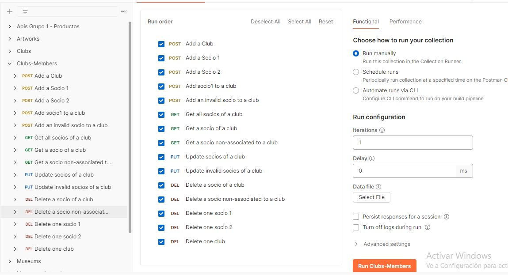

## Description

A continuación los comandos para ejecutar el proyecto, realizar las pruebas, ver las collections y ver los resultados.

## Project setup

Ejecutar el siguiente comando para descargar las librerias

```bash
$ npm install
```

## Run tests

Para ejecutar los tests de la lógica ejecutar el siguiente comando:

```bash
# unit tests
$ npm run test:watch

```
Al ejecutar este comando, se vera el siguiente resultado:


Para la entidad Club, estos son los tests:


Para la entidad Socio, estos son los tests:


Y estos son los tests de la asociación:


## Compile and run the project

Para ejecutar la aplicación ejecutar el siguiente comando:

```bash
# development
$ npm run start

# watch mode
$ npm run start:dev

# production mode
$ npm run start:prod
```


## Collections

En el folder collections se encuentran las collections de cada una de las entidades y la asociación. De igual manera, en cada collection se encuentra la documentación de cada endpoint como se aprecia a continuación:


De igual manera se que estos son los endpoints a ejecutar en la collection para la entidad club (para ello debe ejecutar la aplicación):


Como resultado, los tests son exitosos:


Para la collection de socio, estos son los endpoints:


Y los resultados son:


Finalmente, la collection de la asociacion junto con sus endpoints es:



Y este es el resultado:


